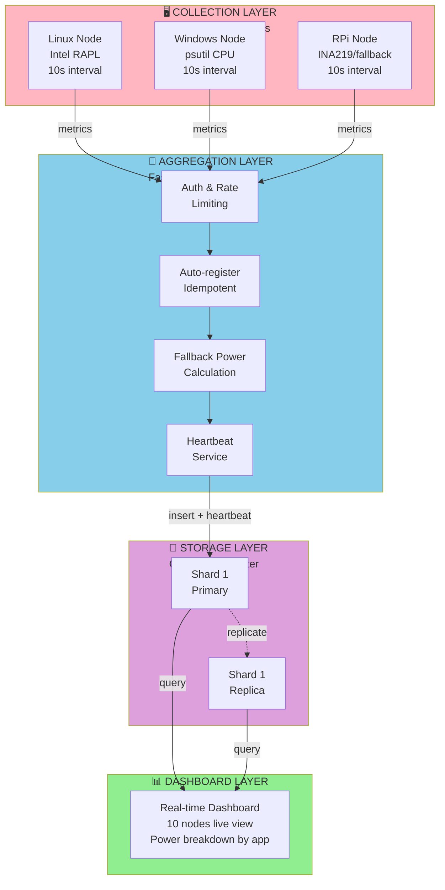

# System Architecture - 3-Tier Distributed Monitoring

## Diagram

## Usage

- **Presentation Slide**: Slide 3 (Solution Overview)
- **File Format**: Mermaid (renders in VS Code, GitHub, Markdown viewers)
- **Export**: Copy to PowerPoint or use Mermaid CLI to export as PNG/SVG

## Key Points

- 4-tier architecture: Collection → Aggregation → Storage → Visualization
- Push-based architecture (daemons initiate)
- Stateless API layer scales horizontally
- Autonomous daemon operation (tolerates backend downtime)
