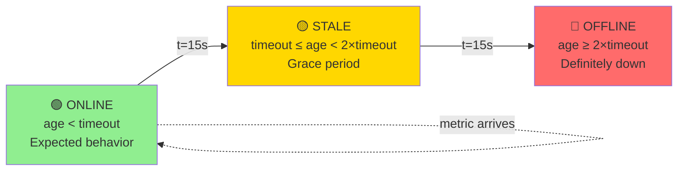

# Node Health States - k-sigma Adaptive Timeout

## Diagram

## Usage

- **Presentation Slide**: Slide 7 (Heartbeat Problem)
- **File Format**: Mermaid (state diagram)
- **Purpose**: Visualize 3-state health model

## Key Points

- **ONLINE**: Node is healthy, sending metrics within expected interval
- **STALE**: Node missed heartbeat, but not definitely down (network jitter grace period)
- **OFFLINE**: Node confirmed down (2× timeout threshold)
- **Transitions**: Automatic based on age relative to k-sigma adaptive timeout

## Example Timeouts

- Node-1 (fast, 10s intervals): timeout = 10 + 4×0.15 = **10.6 seconds**
- Node-2 (slow, 60s intervals): timeout = 60 + 4×2 = **68 seconds**
- Node-3 (unpredictable): Adapts based on historical pattern
