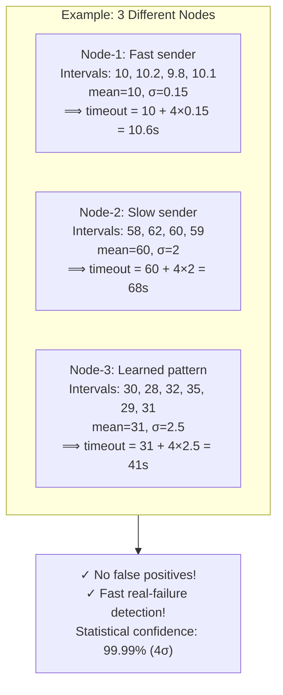

# k-sigma Timeout Learning

## Diagram



## Usage

- **Presentation Slide**: Slide 7 (Heartbeat Problem)
- **File Format**: Mermaid (flow diagram)
- **Purpose**: Explain adaptive timeout calculation

## Formula

```
timeout = mean_interval + 4 × standard_deviation
```

- **mean_interval**: Average time between node's heartbeats
- **standard_deviation**: Variation in that interval
- **4×σ**: 99.99% confidence level (statistical guarantee)

## Why This Works

- Different nodes have different network latencies and load patterns
- Fixed timeout: Either too strict (false alarms) or too loose (slow detection)
- Adaptive k-sigma: Learns each node's unique pattern
- Statistical guarantee: Only 0.01% chance of false positive

## Comparison

| Strategy | Fast Nodes | Slow Nodes | False Positives |
|----------|-----------|-----------|-----------------|
| Fixed 30s | ✓ STALE after 15s | ❌ Never OFFLINE | High |
| Fixed 120s | ✗ Never STALE | ✓ OK | Very High |
| k-sigma | ✓ Timeout ≈ 10s | ✓ Timeout ≈ 68s | 0.01% (optimal) |
