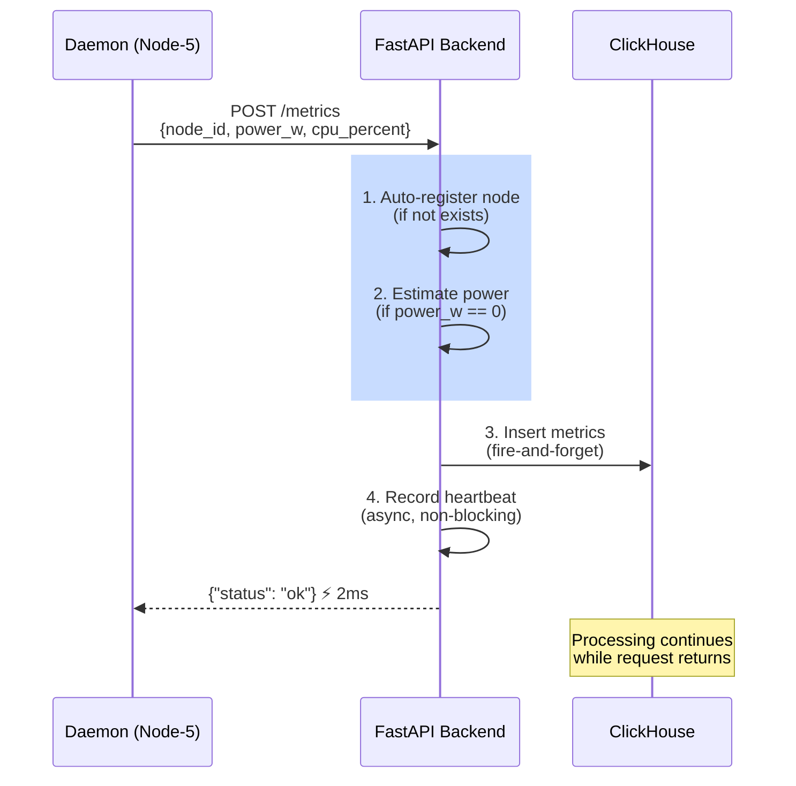

# API Resilience Pattern - Stateless Ingestion

## Diagram

## Usage

- **Presentation Slide**: Slide 8 (API Design for Reliability)
- **File Format**: Mermaid (sequence diagram)
- **Purpose**: Show request lifecycle and resilience patterns

## Key Principles

### 1. **Idempotent Operations**
- Auto-register checks if node exists first
- Safe to retry without side effects
- No database locks needed

### 2. **Graceful Degradation**
- If `power_w == 0` but `cpu_percent > 0`: Estimate power
- Formula: `10W + (cpu% / 100) × 50W`
- Process never rejects data

### 3. **Async Acknowledgment**
- Heartbeat recording is non-blocking
- ClickHouse insert is "fire-and-forget"
- Request returns in <2ms

### 4. **Stateless Design**
- No session tracking
- No locks or transactions
- Scales horizontally (add more API instances)
- Each instance independent

## Production Pattern

This pattern is used by:
- **Stripe**: Payment ingestion API
- **Datadog**: Metrics collection
- **New Relic**: Event ingestion
- **CloudFlare**: Log streaming

All designed for high-reliability distributed data collection.
