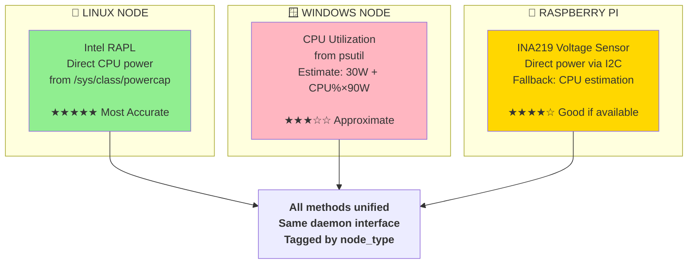

# Data Collection Methods - Heterogeneous Accuracy

## Diagram



## Usage

- **Presentation Slide**: Slide 5 (Data Collection Problem)
- **File Format**: Mermaid (flowchart)
- **Purpose**: Show platform-specific measurement methods

## Implementation Details

### Linux: Intel RAPL (★★★★★ Most Accurate)
- **Source**: `/sys/class/powercap/intel-rapl:0/energy_uj`
- **Measurement**: Direct CPU power from Intel's Running Average Power Limit
- **Accuracy**: ±5% (hardware measurement)
- **Implementation**: `daemon/collectors/power.py` + `daemon/collectors/app_energy.py`
- **Per-app attribution**: Via `ProcessCPUTime / TotalCPUTime` proportional split

### Windows: psutil CPU Estimation (★★★☆☆ Approximate)
- **Source**: psutil + CPU utilization
- **Measurement**: Indirect estimation from CPU scheduler
- **Accuracy**: ±20% (depends on workload)
- **Formula**: `P(watts) = idle_power(30W) + cpu_utilization% × (max_power(120W) - idle_power)`
- **Implementation**: `daemon/collectors/cpu.py` with fallback in `power.py`
- **Limitation**: No per-app granularity, system-wide only

### Raspberry Pi: INA219 Voltage Sensor (★★★★☆ Good if available)
- **Source**: INA219 I2C voltage/current sensor (if connected)
- **Measurement**: Direct voltage × current measurement
- **Accuracy**: ±1% (sensor-dependent)
- **Fallback**: CPU-based estimation if sensor unavailable
- **Implementation**: `daemon/collectors/power.py` with try/except

## Schema Enforcement

All data tagged with metadata:
```python
{
    "node_id": "workstation-01",
    "node_type": "workstation",  # linux, windows, rpi
    "measurement_method": "rapl",  # rapl, psutil, ina219
    "timestamp": "2026-04-06T14:30:00Z",
    "power_w": 45.3,
    "cpu_percent": 62.5
}
```

## Distributed Systems Insight

**Challenge**: Heterogeneous data = quality variance

**Solution**: Adapter Pattern
- Same interface (daemon), different implementations
- Schema enforcement at ingestion
- Dashboard distinguishes real vs. estimated data

**Example Dashboard**:
- Linux nodes: Display real power (RAPL)
- Windows nodes: Display estimated power (psutil) with caveat
- RPi nodes: Direct power if sensor available, else estimate
